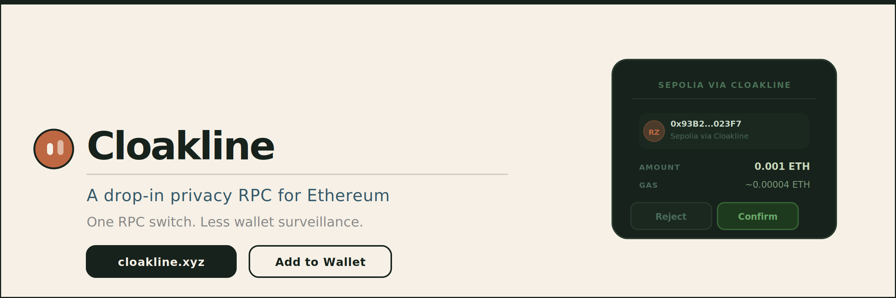
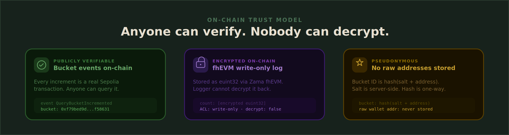
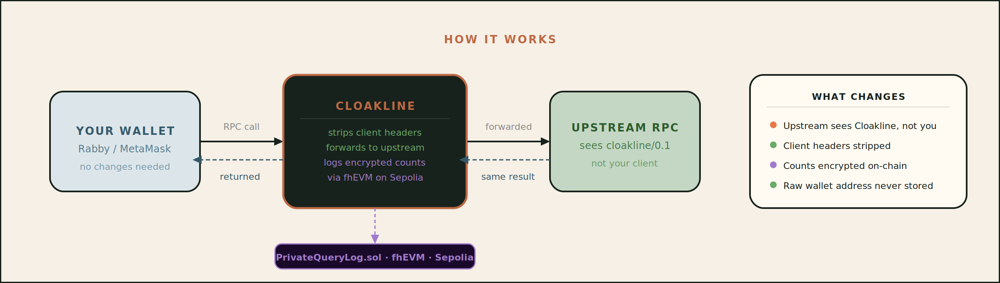

# CLOAKLINE

Cloakline is a drop-in privacy RPC for Ethereum that reduces wallet surveillance risk with one RPC switch.

It routes wallet traffic through a privacy-preserving RPC layer and uses **Zama fhEVM** to keep operational logging **encrypted, pseudonymous, and write-only**.

[Website](https://cloakline.xyz) | [RPC Endpoint](https://rpc.cloakline.xyz)

---

# Problem First

Modern wallet traffic is still surprisingly easy to profile.

In the normal setup, wallets talk directly to upstream RPC providers. That creates an easy place to accumulate a dossier:

- which wallet-related methods were called
- which addresses were queried
- when the user was active
- which direct client path the traffic came from

Over time, that makes wallet-linked surveillance far easier than it should be.

**Cloakline** exists to reduce that linkage surface without forcing users into a new wallet or a new transaction flow.

> Switch one RPC URL, keep using the same wallet, and reduce direct provider-side linkage.

---

# Overview

Cloakline is a privacy-focused RPC layer for Ethereum.

It sits between the wallet and the upstream provider, forwards requests through a cleaner trust boundary, and logs selected operational signals on-chain through fhEVM as encrypted counts under salted pseudonymous bucket IDs.

## Core Principles

1. **ONE RPC SWITCH**
Use the same wallet. Change the RPC endpoint.

2. **LOWER LINKAGE RISK**
The upstream provider sees Cloakline as the request path instead of the same direct client-origin relationship.

3. **NO RAW WALLET ADDRESSES ON-CHAIN**
The logging layer stores salted pseudonymous bucket IDs, not raw addresses.

4. **WRITE-ONLY ENCRYPTED LOGGING**
Cloakline can write usage counts on-chain, but it cannot decrypt the accumulated history later.

---

# Website

The easiest way to try Cloakline is through the public website:

## https://cloakline.xyz

That is the main product surface. It is where people can:

- understand the product quickly
- add the Cloakline RPC to a wallet
- copy the manual RPC details if needed
- use the live website instead of only reading the repository

---

# What Makes It Special

There are already privacy-oriented RPC and relay products.

Cloakline is different because it combines:

- a **drop-in RPC product surface**
- an **honest privacy model**
- and **fhEVM-backed encrypted operational logging**

This is not just a proxy demo.

It is a privacy RPC with an on-chain logging layer where:

- the identity key is pseudonymous
- the count is encrypted
- and the logger is write-only

That separation of write authority from read authority is the most distinctive part of the design.

---

# How It Works

## Without Cloakline

1. The wallet sends RPC requests directly to the upstream provider.
2. The provider sees the request flow from the direct client path.
3. Queried addresses and methods remain visible in the payload.
4. Over time, this makes wallet-linked profiling easier.

## With Cloakline

1. The wallet sends the same RPC request to Cloakline.
2. Cloakline sanitizes and forwards the request upstream.
3. The upstream sees Cloakline as the request path instead of the direct client relationship.
4. Selected methods are batched and logged on-chain.
5. The logging contract stores encrypted counts by salted pseudonymous bucket ID.
6. The logger can write those counts, but cannot decrypt them back later.

## Full Flow

`Wallet -> Cloakline RPC -> Upstream RPC -> fhEVM logging contract`

---

# Tech Stack

| Component | Technology | Purpose |
| --- | --- | --- |
| RPC proxy | **Node.js / TypeScript / Fastify** | Request forwarding and sanitization |
| Website | **React / Vite** | Public product surface and wallet onboarding |
| Wallet discovery | **mipd / EIP-6963** | Injected wallet detection |
| Logging contract | **Zama fhEVM** | Encrypted write-only operational logging |
| Contracts | **Hardhat** | Compile, test, deploy |
| Demo tooling | **Shell scripts / tsx** | State inspection and evidence generation |

---

Built for the PL Genesis hackathon.
